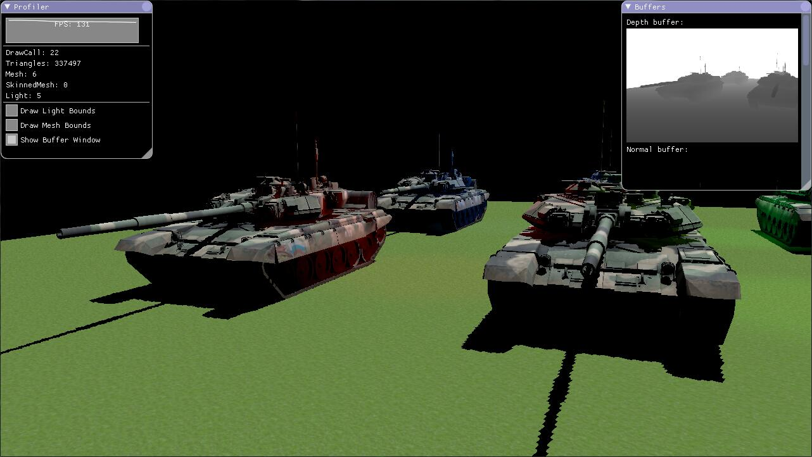
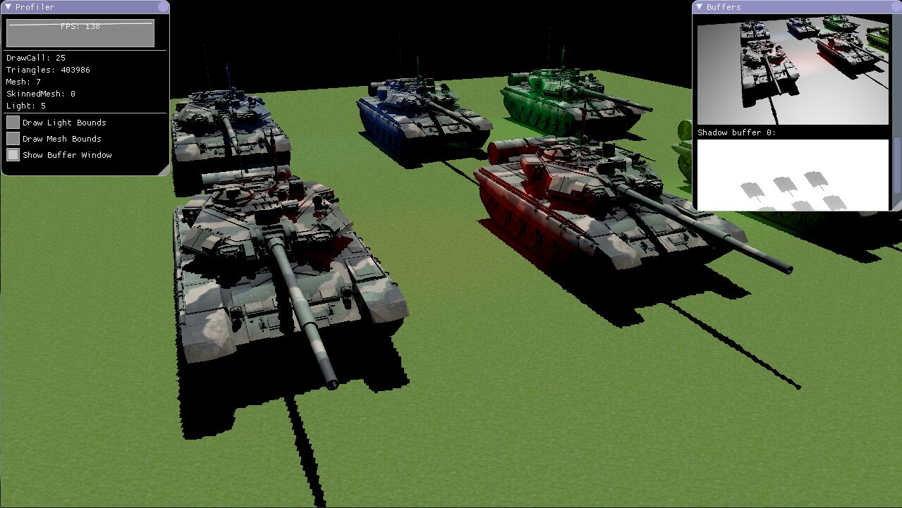

  

# Fury3D

[English](README.md)

## 简介

Fury3d是一个使用C++11与高版本opengl编写的跨平台3D引擎。

目前支持Windows与Mac OSX操作系统。

注意，此项目仅仅是个人学习用项目。

特性: 

* 使用现代的Opengl

* C++11的智能指针简化了内存管理的复杂度

* 灵活的Signal消息系统 (使用函数指针，所以不支持lambda函数)

* 支持FBX模型文件的读取，可直接读取场景的灯光，静态模型，以及带有蒙皮骨骼动画的模型

* 可使用json自由配置的渲染管线

* 内置阉割版light-pre pass渲染管线

* 接入了强大的GUI库[ImGui](https://github.com/ocornut/imgui)

计划:

* 添加阴影. (实现中)

* 添加骨骼动画. (已简单实现，仍需改进)

## 兼容性

测试编译器: 

* MSVC 2013 Community

* Apple LLVM version 7.0.2 (clang-700.1.81)

由于FBX SDK在Windows系统上，只有MSVC编译的版本，所以在Windows上必须用MSVC编译Fury3D。

应该支持所有支持Opengl3.3+的显卡

## 测试截图

## 例子

你可以使用json配置自己的渲染管线，[去看看。](https://github.com/sindney/fury3d/blob/master/examples/bin/Resource/Pipeline/DefferedLighting.json)

一个最简单的例子： 

~~~~~~~~~~cpp
// 这是我们场景树的根节点
auto m_RootNode = SceneNode::Create("Root");

FbxImportOptions importOptions;
importOptions.ScaleFactor = 0.01f;
importOptions.AnimCompressLevel = 0.25f;

// 载入FBX场景，使用 FileUtil::GetAbsPath 来在MAC OSX上得到文件的绝对路径
FbxParser::Instance()->LoadScene(FileUtil::GetAbsPath("Path to fbx"), m_RootNode, importOptions);

// 你可以遍历任意一种载入的资源列表
EntityUtil::Instance()->ForEach<AnimationClip>([&](const AnimationClip::Ptr &clip) -> bool
{
	std::cout << "Clip: " << clip->GetName() << " Duration: " << clip->GetDuration() << std::endl;
	return true;
});

// 也可以通过名字或者名字的哈希值来得到某资源指针
auto clip = EntityUtil::Instance()->Get<AnimationClip>("James|Walk");

// 初始化八叉树
auto m_OcTree = OcTreeManager::Create(Vector4(-10000, -10000, -10000, 1), Vector4(10000, 10000, 10000, 1), 2);
m_OcTree->AddSceneNodeRecursively(m_RootNode);

// 载入渲染管线
auto m_Pipeline = PrelightPipeline::Create("pipeline");
FileUtil::LoadFromFile(m_Pipeline, FileUtil::GetAbsPath("Path To Pipeline.json"));

// 绘制场景
m_Pipeline->Execute(m_OcTree);
~~~~~~~~~~

Signal消息例子: 

~~~~~~~~~~cpp
class Test
{
public:
	void Add(int a, int b)
	{
		std::cout << "Test::Add:" << a + b << std::endl;
	}
};

void Add(int a, int b)
{
	std::cout << "Add:" << a + b << std::endl;
}

auto test = std::make_shared<Test>();

auto signal = Signal<int, int>::Create();

auto key = signal->Connect(&Add);
signal->Connect(test, &Test::Add);

signal->Emit(2, 3);
std::cout << std::endl;

test.reset();

signal->Emit(2, 3);
std::cout << std::endl;

signal->Disconnect(key);

signal->Emit(2, 3);

// Test::Add:5
// Add:5
// 
// Add:5
~~~~~~~~~~

## 非常感谢

* [FbxSdk](http://www.autodesk.com/products/fbx/overview) - Fbx模型加载

* [Rapidjson](https://github.com/miloyip/rapidjson) - Json的序列化反序列化

* [Plog](https://github.com/SergiusTheBest/plog) - 日志的实现

* [ThreadPool](https://github.com/progschj/ThreadPool) - 线程池的实现

* [Stbimage](https://github.com/nothings/stb) - 载入图像

* [Sfml](http://www.sfml-dev.org) - 解决平台相关的窗口相关需求

* [ASSIMP](https://github.com/assimp/assimp) - Mesh的物理资源优化

* [Ogre3d](http://www.ogre3d.org) - 八叉树的实现

* [ImGui](https://github.com/ocornut/imgui) - 测试用GUI库

## 最后

如果你使用SublimeText码字，可以尝试我的 [GLSLCompiler](https://github.com/sindney/GLSLCompiler) 组件来debug glsl代码 :D
