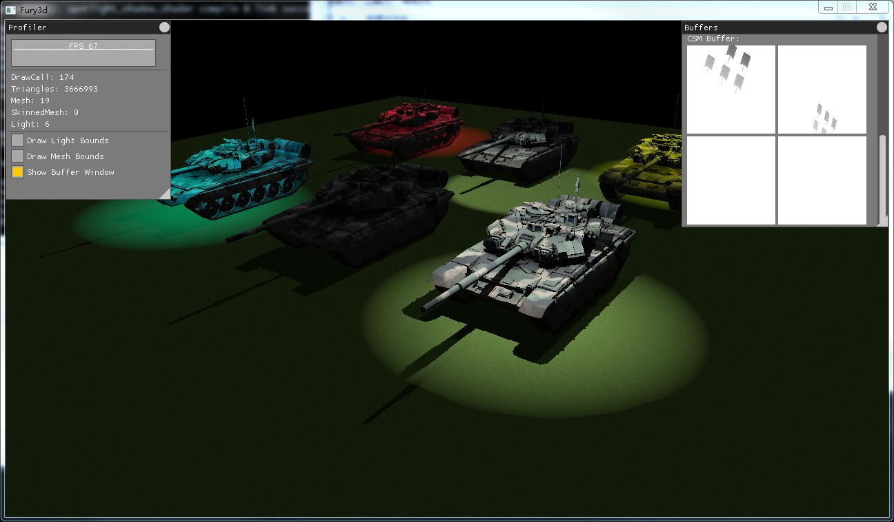
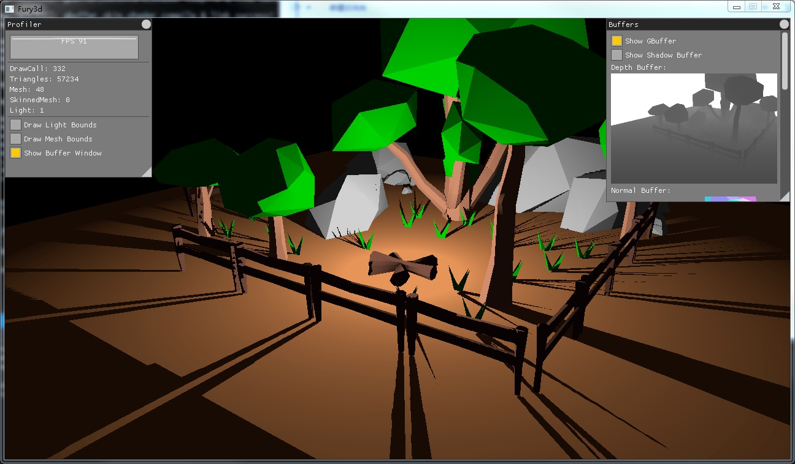

  

# Fury3D

[English](README.md)

## 简介

Fury3d 是一个使用 C++17 与现代 OpenGL 编写的跨平台 3D 引擎。

目前支持 Windows 与 macOS。

注意，此项目仅仅是个人学习用项目。

特性:

* 使用现代的 OpenGL（3.3+ Core Profile）。
* C++17 智能指针简化了内存管理。
* 灵活的 Signal 消息系统（基于成员函数指针，所以不支持 lambda）。
* 集成 sol2 + Lua 5.4 脚本绑定 —— 主循环可以从 `.lua` 文件驱动。
* 可使用 JSON 自由配置的渲染管线。
* 内置 light pre-pass 延迟渲染管线。
* 接入了强大的 GUI 库 [ImGui](https://github.com/ocornut/imgui)。
* 方向光、点光、聚光灯阴影贴图（可选级联）。
* 自定义场景文件格式，支持输出 JSON 或 LZ4 压缩。

计划:

* 添加阴影。（已实现，需改进。）
* 添加骨骼动画。（已简单实现，仍需改进。）
* 实现 glTF 2.0 导入器，使用 `tinygltf`。（进行中 —— FBX SDK 已移除，`tinygltf` 已作为子模块引入，导入器是下一个变更。）
* 实现 HDR 管线与 PBR 材质。

## 兼容性

测试编译器:

* AppleClang 16 (macOS Darwin 24.x)
* GCC 9+ / Clang 10+ on Linux
* MSVC 16+（Visual Studio 2019+）on Windows

应该支持所有支持 OpenGL 3.3+ 的显卡。

通过 Git 子模块引入的第三方库（位于 `engine/ThirdParty/`）：

* SFML 3.1.0 —— 窗口/输入/上下文。
* rapidjson 1.1.0 —— JSON 序列化。
* Lua 5.4.7 + sol2 v3.5.0 —— 脚本桥。
* tinygltf v2.9.7 —— glTF 2.0 加载器（导入器是下一个变更）。
* LZ4、STB image、ImGui —— 直接打包在仓库内。

不需要 FBX SDK。

## 测试截图





## 运行示例

```sh
git clone --recursive https://github.com/sindney/fury3d
cd fury3d
cmake -S engine -B build-engine
cmake --build build-engine --target fury -j
cp build-engine/fury examples/bin/fury        # 首次需手动复制
cd examples/bin && ./fury Demo.lua
```

操作方式：

* **WASD** / **方向键** —— 沿相机正前/侧向移动。
* **Space** / **LControl** —— 上下移动。
* **按住鼠标左键拖动** —— 旋转视角（yaw / pitch）。
* **滚轮** —— 调整移动速度。
* **LShift** —— 5 倍速倍率。
* **菜单栏** —— `File → Quit`、`View → Profiler / GBuffer / Shadow Buffers`、`Camera → Settings`。

## 例子

示例现在由 `examples/Demo.lua` 驱动。最小的"场景 + 飞行相机"示例：

```lua
local function on_init()
    local octree = OcTree.Create(
        Vector4(-1000, -1000, -1000, 1),
        Vector4( 1000,  1000,  1000, 1),
        2)

    -- 创建并激活场景
    Scene.SetActive(Scene.Create("main", FileUtil.GetAbsPath(), octree))
    FileUtil.LoadSceneFromCompressedFile(
        Scene.GetActive(),
        FileUtil.GetAbsPath("Resource/Scene/scene.bin"))

    -- 相机
    local camera = Camera.Create()
    camera:PerspectiveFov(0.7854, 1.778, 1, 100)

    local cam_node = SceneNode.Create("camNode")
    cam_node:SetLocalPosition(Vector4(0, 10, 25, 1))
    cam_node:AddComponent(Transform.Create())
    cam_node:AddComponent(camera)
    cam_node:Recompose(true)

    -- 渲染管线
    Pipeline.SetActive(PrelightPipeline.Create("pipeline"))
    Pipeline.GetActive():SetCurrentCamera(cam_node)
    FileUtil.LoadPipelineFromFile(
        Pipeline.GetActive(),
        FileUtil.GetAbsPath("Resource/Pipeline/DefferedLightingLambert.json"))
end

local function on_update(dt)
    Gui.ShowDefault(dt)
    Gui.Render()
    Pipeline.GetActive():Execute(SceneManager.Instance())
end

Engine.run({ on_init = on_init, on_update = on_update })
```

完整的 Lua 绑定 API 文档参见 `docs/LUA.md`，WASD 飞行相机 + 相机设置面板的完整示例参见 `examples/Demo.lua`。

也可以使用 JSON 自由配置渲染管线 —— [示例文件](https://github.com/sindney/fury3d/blob/master/examples/bin/Resource/Pipeline/DefferedLightingLambert.json)。

## 非常感谢

* [Rapidjson](https://github.com/miloyip/rapidjson) —— Json 的序列化反序列化
* [Plog](https://github.com/SergiusTheBest/plog) —— 日志实现
* [ThreadPool](https://github.com/progschj/ThreadPool) —— 线程池
* [Stb_image](https://github.com/nothings/stb) —— 图像加载
* [LZ4](https://github.com/Cyan4973/lz4) —— 场景文件压缩与解压缩
* [SFML](http://www.sfml-dev.org) —— 平台相关窗口/输入
* [tinygltf](https://github.com/syoyo/tinygltf) —— glTF 2.0 加载器
* [Lua](https://www.lua.org) + [sol2](https://github.com/ThePhD/sol2) —— 脚本桥
* [Ogre3d](http://www.ogre3d.org) —— 八叉树实现参考
* [ImGui](https://github.com/ocornut/imgui) —— 调试 GUI
* [RenderDoc](https://github.com/baldurk/renderdoc) —— OpenGL 调试

## 最后

如果你使用 SublimeText 写代码，可以尝试我的 [GLSLCompiler](https://github.com/sindney/GLSLCompiler) 插件来调试 GLSL 代码 :D
