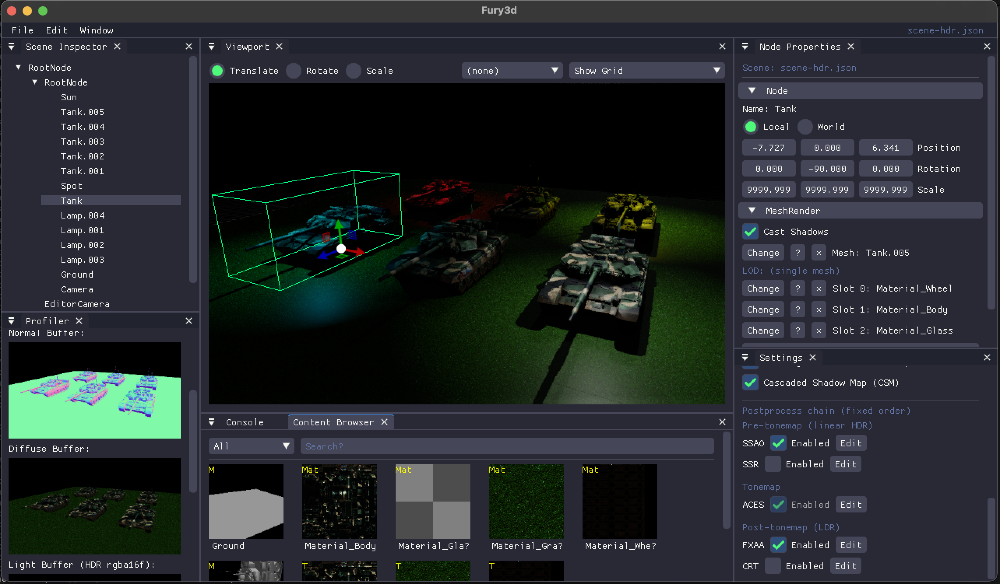
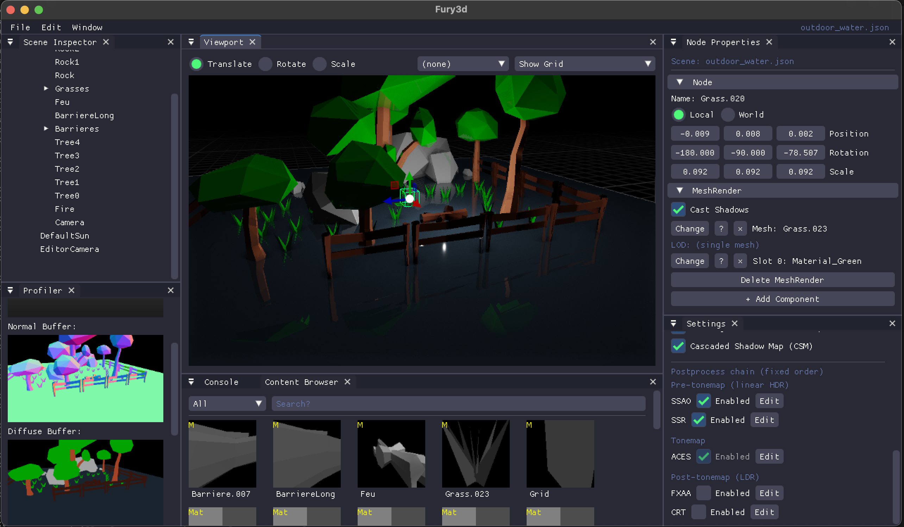
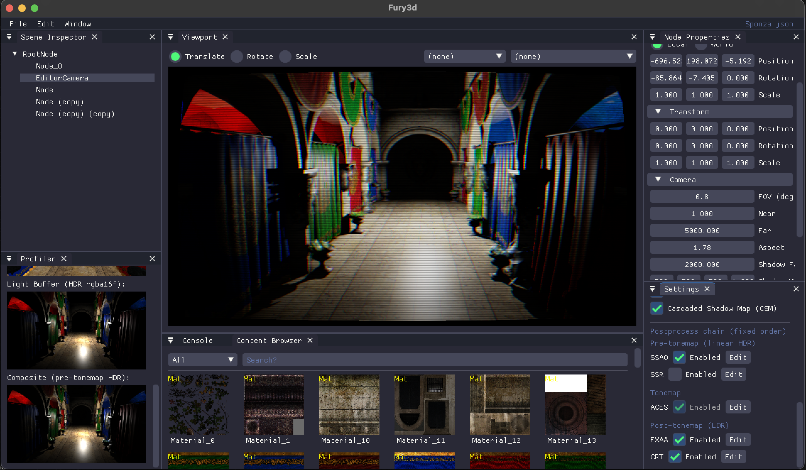
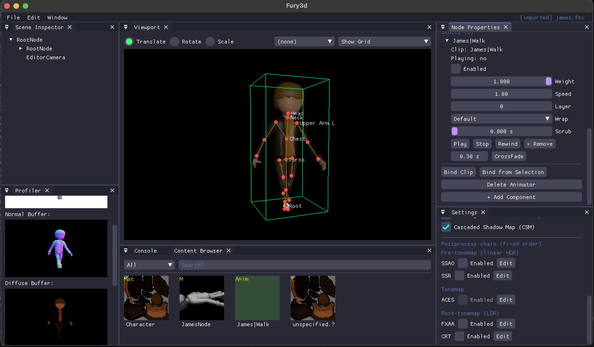

  

# Fury3D

[English](README.md)

## 简介

Fury3D 是一个使用 C++17 与 OpenGL 编写的跨平台 3D 渲染引擎，附带 Lua 驱动的编辑器、JSON 可配置的渲染管线，以及数据驱动后处理特效链。

在 Kimi K3、MiniMax M3、GLM 5.2 与 Claude Code 的协助下继续开发。

> 先用 M3 和 GLM,再主要用 K3,因为它支持多模态,比 GLM 更容易买到,而且能力非常强。

目前支持 Windows 与 macOS。代码面向学习——编辑器、导入器与着色器从头到尾都短得可以读完。

### 亮点

* **OpenGL**（3.3+ Core Profile），每个绘制显式声明状态（参考 Vulkan PSO 的写法），特效链与调试绘制不会把 `GL_BLEND` 泄漏到其它绘制中。
* **C++17** 智能指针，**`sol2 + Lua 5.4`** 脚本绑定。
* **JSON 可配置管线** — 每个 Pass、每个着色器变体、每个 Uniform 都放在运行时同目录的 `.json` 中。
* **编辑器（ImGui + ImGuizmo）** — 场景检视器、内容浏览器、节点属性面板、视口 Gizmo、原生文件对话框、可配置并持久化的停靠布局。
* **CLI** — `fury convert gltf|fbx|scene` 将资源转换为运行时形式（json 或 LZ4 压缩的 bin），针对以厘米为单位的模型提供 `--auto-scale`。
* **glTF 2.0 导入器** — 已 vendor `tinygltf`，支持 alpha-mode（OPAQUE/MASK/BLEND）以及 `KHR_materials_transmission` 映射。FBX 入口会链式调用 `FBX2glTF` + glTF 导入器。
* **HDR 渲染管线** — `RGBA16F` 中间合成、ACES Tonemap、自动按规则顺序执行特效链。
* **数据驱动后处理特效链** — SSAO、SSR、FXAA、CRT、ACES。特效声明 `stage`（`pre_tonemap` / `tonemap` / `post_tonemap`）；链按规范顺序执行并自动注入 Tonemap。可在 Settings 面板对每个特效覆盖 Uniform。
* **透明物体渲染** — 由远及近的 Alpha 混合基础绘制 + 每光源的 Additive 绘制，关闭深度写入，前向着色器对 Alpha 预乘。
* **蒙皮网格 + 动画** — glTF Skinning、由关节 TRS 驱动的骨骼矩阵；`Animator` 组件支持状态权重 / 速度 / 循环模式 / 交叉淡入；用 Console 叠层调试关节。
* **级联阴影贴图**（太阳光）+ 标准的聚光、点光阴影贴图。
* **OcTree 空间索引** — 默认立方体自动扩张，Profiler 中带 Spatial 面板。
* **LZ4 压缩的场景格式**（`.bin`）— 编辑器默认保存格式；`.json` 也可用，便于人工阅读调试。

## 截图



*坦克车队采用 HDR PBR + 级联阴影贴图 + 完整特效链渲染。Settings 面板可单独开启每个特效，并打开每个特效的 Uniform 覆盖对话框；Profiler 窗口显示 GBuffer 的法线 + 漫反射副本。*



*SSR 屏幕空间反射：地面粗糙度 0.05 的湿润地表实时反射出树木与栅栏，同样的 Profiler / 特效链布局。*



*Khronos Sponza（HDR）— 规范特效链覆盖了庞大的纹理种类。Tonemap 前的 HDR 合成面板可以预览未调色的累加结果以及终端的 sRGB 编码。*



*蒙皮网格 + Animator 组件：关节 TRS 驱动蒙皮形变，关节调试叠层绘制所选网格关节骨架，Animator 检视器暴露状态、权重、速度、Layer、循环模式、当前时间、交叉淡入。*

## 兼容性

测试过的编译器：

* AppleClang 16（macOS Darwin 24.x）
* Linux 上的 GCC 9+ / Clang 10+
* Windows 上的 MSVC 16+（Visual Studio 2019+）

理论上任何支持 OpenGL 3.3+ 的 GPU 都可以运行。

Vendor 的依赖（位于 `engine/ThirdParty/` 的 git submodule）：

* SFML 3.1.0 — 窗口 / 输入 / 上下文。
* rapidjson 1.1.0 — JSON 序列化。
* Lua 5.4.7 + sol2 v3.5.0 — 脚本绑定。
* tinygltf v2.9.7 — glTF 2.0 加载器。
* meshoptimizer — 网格优化 / 简化 / LOD 链。
* nativefiledialog-extended（nfd）— 平台原生文件对话框（仅编辑器）。
* LZ4、STB image、ImGui、ImGuizmo、ImReflect — 内嵌在源码树中。

不依赖 FBX SDK。

## 构建

Fury3D 使用 CMake（≥ 3.22），所有第三方依赖都以 git submodule 形式 vendor 到 `engine/ThirdParty/`。克隆后，只需一次性初始化 submodule：

```sh
git clone https://github.com/sindney/fury3d
cd fury3d
git submodule update --init --recursive
```

`--recursive` 是必需的：部分 submodule 还嵌套了 submodule（nfd 在 Linux 路径上 vendor 了 `wayland-protocols`，在 macOS/Windows 上是无用的）。已存在的克隆执行同一条命令即可更新 submodule。

然后配置并构建：

```sh
cmake -S engine -B build-engine
cmake --build build-engine -j
```

`fury`（纯运行时）和 `furye`（运行时 + 编辑器）会直接输出到 `examples/`，与 `Editor.lua`、`Resource/` 同目录。运行只需：

```sh
cd examples && ./furye Editor.lua
```

如只需构建 `fury`（不带 ImGui 编辑器窗口、不依赖 nfd，更小的二进制）：

```sh
cmake -S engine -B build-engine -DWITH_EDITOR=OFF
cmake --build build-engine -j
```

### 构建选项

| 选项                | 默认值 | 说明                                                                 |
| ------------------- | ------ | -------------------------------------------------------------------- |
| `WITH_EDITOR`       | `ON`   | 启用 C++ 编辑器（场景检视器、内容浏览器、Gizmo、原生文件对话框）。需要 `GUI_IMP=ON`。关闭后只构建 `fury`。 |
| `GUI_IMP`           | `ON`   | 编译 ImGui 叠层（HUD、调试控件）。`WITH_EDITOR` 启用时必须同时启用。 |
| `BUILD_SHARED_LIBS` | `OFF`  | 默认构建 `fury` / `furye` 可执行文件。设为 `ON` 时输出 `libfury.{dylib,so,dll}` 以便嵌入——此时会移除 Lua 启动器 `main`。 |
| `EXPORT_DLL`（Windows） | `ON` | 定义 `FURY_API_EXPORT`，让共享库导出符号。对静态构建无影响。 |
| `FURY_WITH_TRACY`   | Debug / RelWithDebInfo / 多配置生成器为 `ON`，Release / MinSizeRel 为 `OFF` | 启用 Tracy 性能分析（vendor 于 `engine/ThirdParty/tracy`），并自动把 `tracy-profiler` 与 `tracy-capture` 构建到 `examples/`。详见 [docs/TRACY.md](docs/TRACY.md)。 |
| `FURY_WITH_TRACY_GPU` | Tracy 开启时为 `ON` | 增加 OpenGL timer-query GPU zone。在 Apple/TBDR 驱动上不可靠，可按机器关闭。 |

### 增加一个 vendor 依赖

`engine/ThirdParty/` 下的每个 submodule 都按同一个套路接入：先用 `if(EXISTS ...)` 在配置时做存在性检查，缺失时打印正确的 git 命令；然后视上游是否自带 CMake，选择 `add_subdirectory(...)` 或直接 `file(GLOB)` 编为静态库。仅编辑器使用的依赖要包在 `if(WITH_EDITOR)` 之后。nfd 的 macOS 后端会编译 `nfd_cocoa.m`，因此 `engine/CMakeLists.txt` 在 Apple 上声明 `LANGUAGES C CXX OBJC`。

## 运行示例 / 编辑器

```sh
cd examples && ./furye Editor.lua
```

`Editor.lua` 按 argv 决定启动场景：

* 不传参数 → `Projects/tank/scene.bin`（内置的坦克场景）。
* `./furye Editor.lua outdoor.fbx` → 通过 glTF 导入器加载 `outdoor.fbx`（先尝试字面路径，再尝试 `Projects/`、`Resource/Scene/` 前缀）。

只构建了 `fury` 的话，启动方式相同（`./fury Editor.lua`），只是不再有 ImGui 编辑器窗口——不传 `.lua` 即可运行自己的脚本。

### 控制

* **WASD** / **方向键** — 沿相机前向 / 横移。
* **按住鼠标左键 + 拖动** — 偏航、俯仰。
* **鼠标滚轮** — 调整移动速度。
* **LShift** — 5× 速度加成。
* **F2** 或右键 → **重命名** — 重命名所选节点。
* **场景检视器中双击节点** — 让相机框选该节点（与 File→Open 时的整场景自动框选共用同一套数学）。
* **File → Open...** / **Ctrl+O** — 原生单选打开对话框（任何可加载格式：`.json`、`.bin`、`.gltf`、`.glb`、`.fbx`）。打开时编辑器会自动检测并缩放该导入（cm→m）、执行自动框选，并在下一个输入事件之前就抵达框选后的相机姿态。
* **File → Import...** / **Ctrl+Shift+I** — 原生多选打开对话框（合并到当前场景中）。
* **File → Save As...** / **Ctrl+Shift+S** — 原生系统保存对话框。
* **菜单栏** — `File`、`Edit`、`Window`，以及项目发出的 `Camera` 菜单。
* **Settings → Editor** — `Snap Enabled`、吸附步长、**`Auto-Focus on Open`**（默认开启；通过 `imgui.ini` 中的 `auto_focus` 编辑器设置切换）。相机控制（Move Speed、Mouse Sensitivity）。

### 编辑器窗口

| 窗口              | 作用                                                                   |
| ----------------- | ---------------------------------------------------------------------- |
| **Scene Inspector** | 节点树、拖拽重设父子、双击叶子框选相机。                              |
| **Viewport**        | 渲染表面 + 工具栏（Gizmo 模式、调试视图、叠层开关）。                  |
| **Node Properties** | Mode 切换（Local/World）、变换（根节点的变换锁定为 identity——在那里改变它会缩小 Gizmo）、MeshRender 材质槽、Animator 状态检视。 |
| **Content Browser** | 当前场景中的 Mesh、Material、Texture、AnimationClip 卡片，类型筛选 + 模糊搜索，F2 / 右键重命名，双击打开资产编辑器。 |
| **Settings**        | RenderSettings（HDR 开关、CSM、每个特效的启用 + Uniform 覆盖 Edit 对话框）、相机控制、导入标志（自动缩放、法线生成、网格焊接）。 |
| **Profiler**        | FPS 折线图、DrawCall / 三角形计数、级联光的阴影贴图查看、GBuffer 纹理预览。 |
| **Console**         | `FURY_INFO` / `WARN` / `ERROR` 日志缓冲 + 即时 Lua 求值（错误就地显示）。 |

## CLI

同一个 `fury` 二进制在 `argv[1]` 是已知子命令时进入离线资源 CLI 模式——不创建窗口、不创建 GL 上下文、不开 Lua 虚拟机（`fury exec` 例外）。

```sh
cd examples
./fury help
./fury convert gltf  character.glb character.bin          # 引擎运行时格式
./fury convert fbx   tank.fbx tank.bin --auto-scale       # FBX -> glTF -> 引擎；自动缩放 cm-native 网格
./fury convert scene tank.bin tank.json                    # bin <-> json 互转
./fury info tank.bin                                      # CPU 端摘要（节点、网格、AABB……）
./fury exec tank.bin some-script.lua                       # 对场景跑无头 Lua
./fury render-mesh tank.bin Tank_005 /tmp/tank.png         # 单个网格缩略图
```

完整参数见 `./fury help <subcommand>`；参考文档见 `docs/CLI.md`。

## Special thanks

* [Rapidjson](https://github.com/miloyip/rapidjson) — pipeline / scene JSON 加载
* [Plog](https://github.com/SergiusTheBest/plog) — 日志实现
* [ThreadPool](https://github.com/progschj/ThreadPool) — 线程池实现
* [Stb_image](https://github.com/nothings/stb) — 图像加载
* [LZ4](https://github.com/Cyan4973/lz4) — 场景文件压缩 / 解压
* [SFML](http://www.sfml-dev.org) — OS 窗口 / 输入 / 上下文
* [tinygltf](https://github.com/syoyo/tinygltf) — glTF 2.0 加载器
* [FBX2glTF](https://github.com/facebookincubator/FBX2glTF) — FBX → glTF（按平台预编译的二进制已 vendor）
* [meshoptimizer](https://github.com/zeux/meshoptimizer) — 网格优化 + LOD 链
* [Lua](https://www.lua.org) + [sol2](https://github.com/ThePhD/sol2) — 脚本绑定
* [Ogre3d](http://www.ogre3d.com) — OcTree 实现参考
* [ImGui](https://github.com/ocornut/imgui) + [ImGuizmo](https://github.com/CedricGuillemet/ImGuizmo) + [ImReflect](https://github.com/CedricGuillemet/ImReflect) — 编辑器 UI / Gizmo / 反射检视器
* [nativefiledialog-extended](https://github.com/samhocevar/nativefiledialog) — 跨平台文件对话框
* [RenderDoc](https://github.com/baldurk/renderdoc) — OpenGL 调试工具
* [glTF-Sample-Assets](https://github.com/KhronosGroup/glTF-Sample-Assets) - 示例资源
