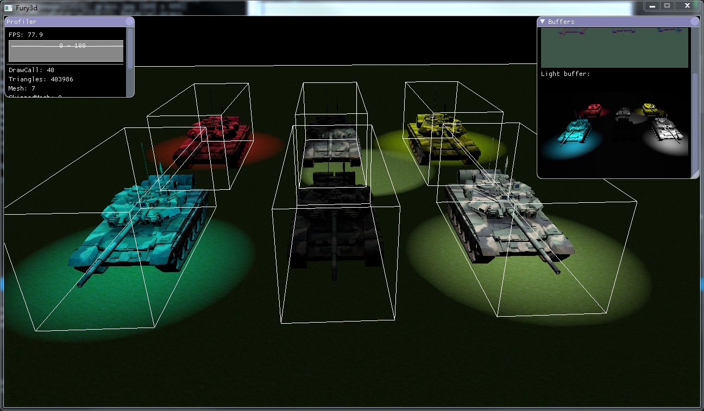

  

# Fury3D

[中文简体](README.ZH-CN.md)

## Introduction

Fury3d is a cross-platform rendering engine written in c++11 and modern opengl.

Works on windows && osx operating systems currentlly.

Please note, this is just a simple project for study purpose.

Features: 

* Use modern opengl.

* C++11 smart pointers made memory management easier.

* Flexible signal message system. (use function pointers, so it won't accept lambdas, sry)

* Support fbx model format, you can load static meshes, skinned meshes and lights directlly.

* Easy rendering pipeline management through json serialization functionality.

* Build-in light-pre pass rendering pipeling.

* Intergates powerful gui library [ImGui](https://github.com/ocornut/imgui).

Plans:

* Add shadow maps. (Implimenting)

* Add skeleton animation support. (Done, but need improvements)

## Compatibility

Tested compilers: 

* MSVC 2013 Community

* Apple LLVM version 7.0.2 (clang-700.1.81)

Because fbxsdk only offers MSVC builds on windows, so you must use MSVC to build the library.

Should work with any graphic card that supports opengl 3.3 +

## Screenshots

## Examples

You can setup custom rendering pipeline using json file, [check it out.](https://github.com/sindney/fury3d/blob/master/examples/bin/Resource/Pipeline/DefferedLighting.json)

A simple demo should look like this: 

~~~~~~~~~~cpp
// This is the root of our scene
auto m_RootNode = SceneNode::Create("Root");

FbxImportOptions importOptions;
importOptions.ScaleFactor = 0.01f;
importOptions.AnimCompressLevel = 0.25f;

// Load fbx scene, use FileUtil::GetAbsPath to get absolute file path on osx.
FbxParser::Instance()->LoadScene(FileUtil::GetAbsPath("Path to fbx"), m_RootNode, importOptions);

// You can iterate a certain type of imported resources.
EntityUtil::Instance()->ForEach<AnimationClip>([&](const AnimationClip::Ptr &clip) -> bool
{
	std::cout << "Clip: " << clip->GetName() << " Duration: " << clip->GetDuration() << std::endl;
	return true;
});

// Or you can simply find an resource by it's name or hashcode.
auto clip = EntityUtil::Instance()->Get<AnimationClip>("James|Walk");

// Setup octree
auto m_OcTree = OcTree::Create(Vector4(-10000, -10000, -10000, 1), Vector4(10000, 10000, 10000, 1), 2);
m_OcTree->AddSceneNodeRecursively(m_RootNode);

// Load pipeline
auto m_Pipeline = PrelightPipeline::Create("pipeline");
FileUtil::LoadFromFile(m_Pipeline, FileUtil::GetAbsPath("Path To Pipeline.json"));

// Draw scene
m_Pipeline->Execute(m_OcTree);
~~~~~~~~~~

Signal system demo: 

~~~~~~~~~~cpp
class Test
{
public:
	void Add(int a, int b)
	{
		std::cout << "Test::Add:" << a + b << std::endl;
	}
};

void Add(int a, int b)
{
	std::cout << "Add:" << a + b << std::endl;
}

auto test = std::make_shared<Test>();

auto signal = Signal<int, int>::Create();

auto key = signal->Connect(&Add);
signal->Connect(test, &Test::Add);

signal->Emit(2, 3);
std::cout << std::endl;

test.reset();

signal->Emit(2, 3);
std::cout << std::endl;

signal->Disconnect(key);

signal->Emit(2, 3);

// Test::Add:5
// Add:5
// 
// Add:5
~~~~~~~~~~

## Special thanks

* [FbxSdk](http://www.autodesk.com/products/fbx/overview) - for loading fbx model

* [Rapidjson](https://github.com/miloyip/rapidjson) - for loading pipeline setups

* [Plog](https://github.com/SergiusTheBest/plog) - for log implimentation

* [ThreadPool](https://github.com/progschj/ThreadPool) - for threadpool implimentation

* [Stbimage](https://github.com/nothings/stb) - for image loading

* [Sfml](http://www.sfml-dev.org) - for os related window/input/context handling

* [ASSIMP](https://github.com/assimp/assimp) - for mesh optimization

* [Ogre3d](http://www.ogre3d.org) - for octree implimentation

* [ImGui](https://github.com/ocornut/imgui) - for debug gui

## One more thing

If you use sublimetext, you can try my [GLSLCompiler](https://github.com/sindney/GLSLCompiler) plugin to debug glsl code :D
