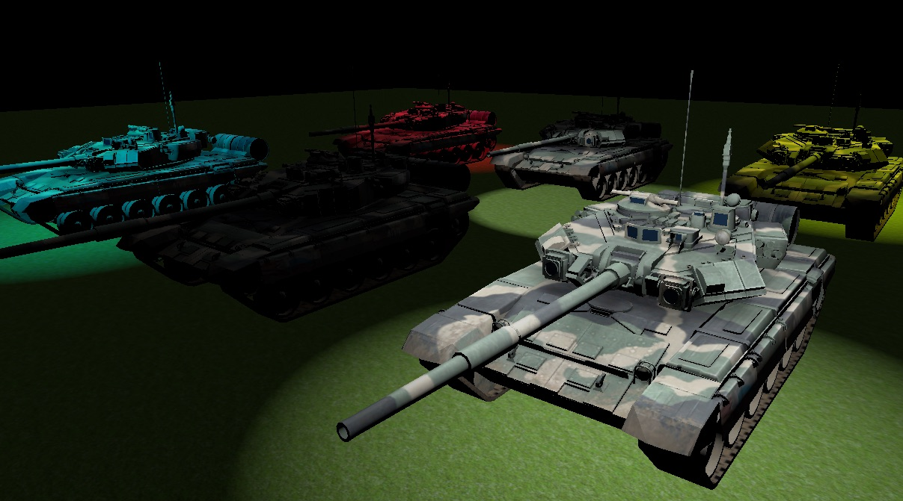

 

# Fury3D

## Introduction

Fury3d is a cross-platform rendering engine written in c++11 and modern opengl.

Works on windows && osx operating systems currentlly.

Please note, this is just a simple project for study purpose.

Features: 

* Use modern opengl.

* C++11 smart pointers made memory management easier.

* Support fbx model format, you can load static models and lights directlly.

* Easy rendering pipeline management through json serialization functionality.

* Build-in light-pre pass rendering pipeling.

* Basic skeleton animation support.

Plans:

* Add shadow maps.

* Add skeleton animation support. (Done, but need improvements)

## Compatibility

Tested compilers: 

* MSVC 2013 Community

* Apple LLVM version 7.0.2 (clang-700.1.81)

Because fbxsdk only offers MSVC builds on windows, so you must use MSVC to build the library.

Should work with any graphic card that supports opengl 3.3 +

## Example

You can setup custom rendering pipeline using json file, [check it out.](https://github.com/sindney/fury3d/blob/master/examples/bin/Resource/Pipeline/DefferedLighting.json)

A simple demo should look like this: 

~~~~~~~~~~cpp
// load scene
SceneNode::Ptr m_RootNode = SceneNode::Create("Root");

FbxImportOptions importOptions;
importOptions.ScaleFactor = 0.01f;
importOptions.AnimCompressLevel = 0.25f;

// Use FileUtil::GetAbsPath to get absolute file path on osx.
FbxUtil::Instance()->LoadScene(FileUtil::Instance()->GetAbsPath("Path to fbx"), m_RootNode, importOptions);

// setup octree
OcTree::Ptr m_OcTree = OcTree::Create(Vector4(-10000, -10000, -10000, 1), Vector4(10000, 10000, 10000, 1), 2);
m_OcTree->AddSceneNodeRecursively(m_RootNode);

// Load pipeline
PrelightPipeline::Ptr m_Pipeline = PrelightPipeline::Create("pipeline");
FileUtil::Instance()->LoadFromFile(m_Pipeline, FileUtil::Instance()->GetAbsPath("Path To Pipeline.json"));

// draw scene
m_Pipeline->Execute(m_OcTree);
~~~~~~~~~~

## Screenshots

## Special thanks

* [FbxSdk](http://www.autodesk.com/products/fbx/overview) - for loading fbx model

* [Rapidjson](https://github.com/miloyip/rapidjson) - for loading pipeline setups

* [Plog](https://github.com/SergiusTheBest/plog) - for logging

* [Stbimage](https://github.com/nothings/stb) - for image loading

* [Sfml](http://www.sfml-dev.org) - for example program

* [ASSIMP](https://github.com/assimp/assimp) - for mesh optimization

* [Ogre3d](http://www.ogre3d.org) - for octree implimentation

## One more thing

If you use sublimetext, you can try my [GLSLCompiler](https://github.com/sindney/GLSLCompiler) plugin to debug glsl code :D
