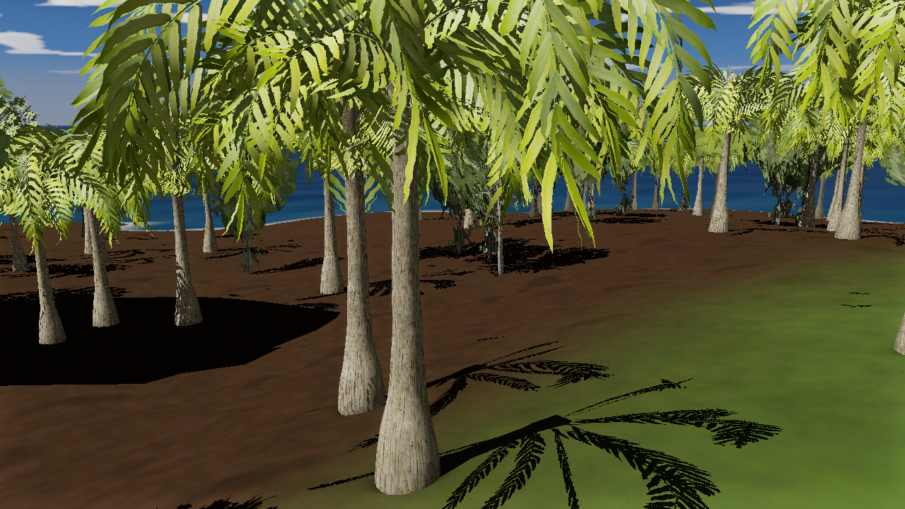
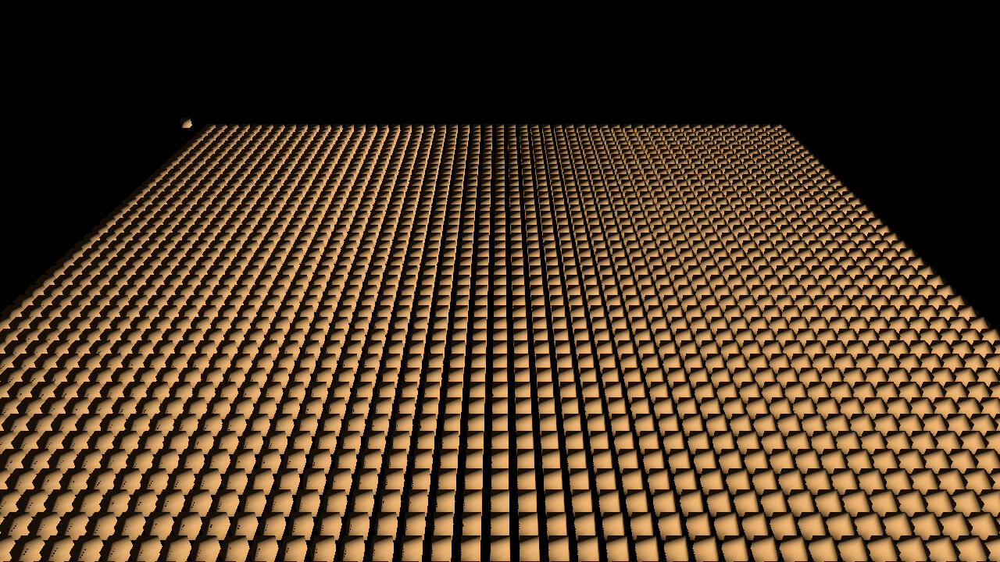
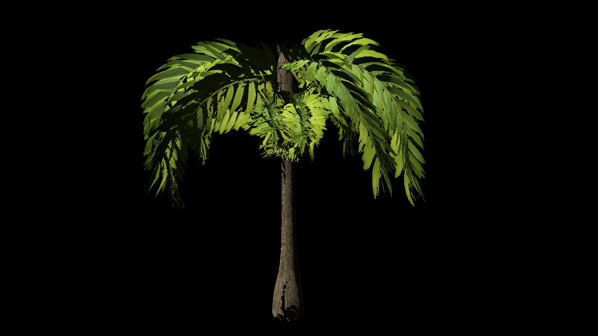
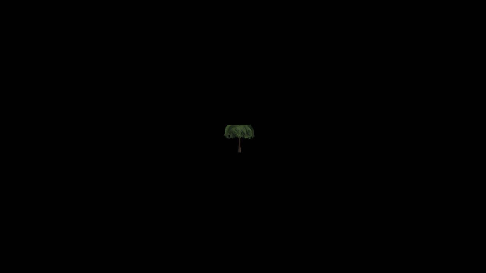
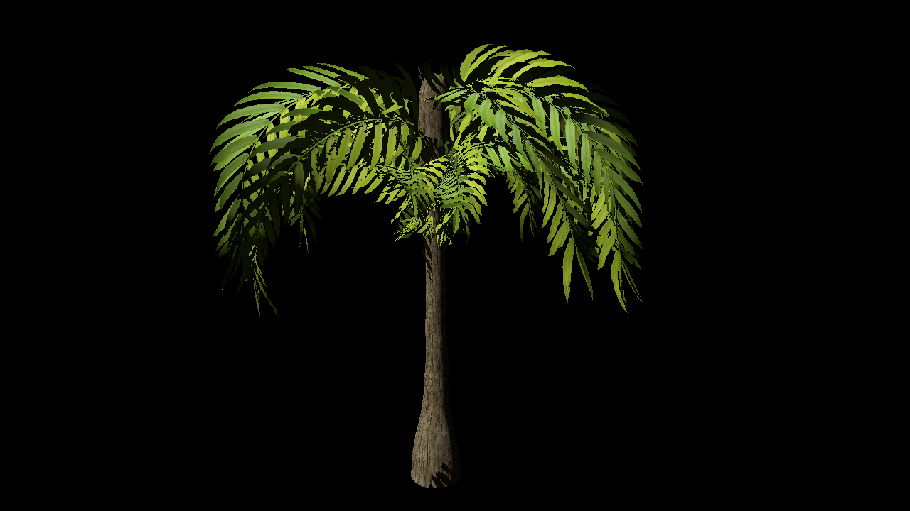
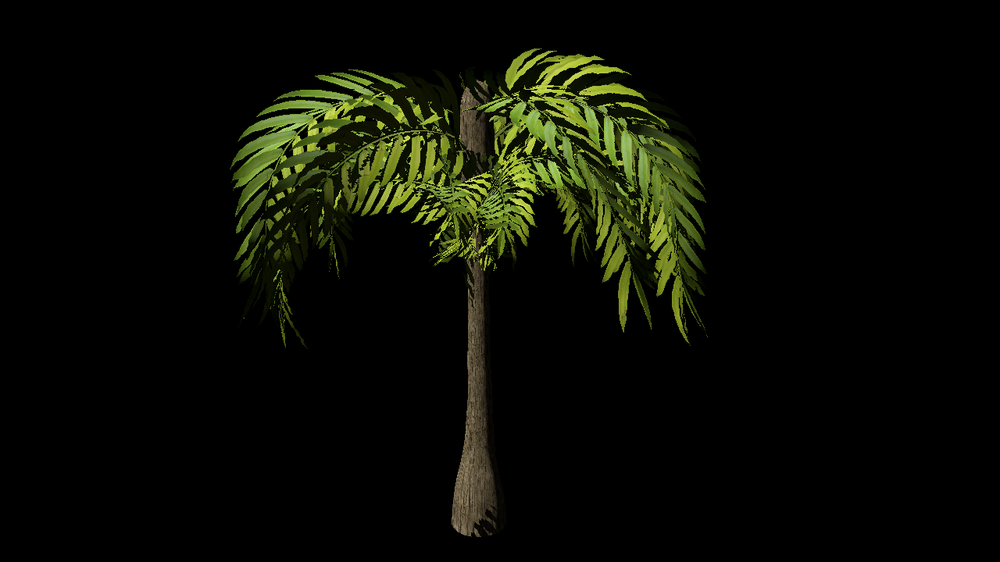
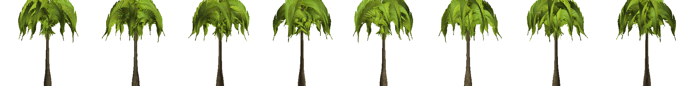
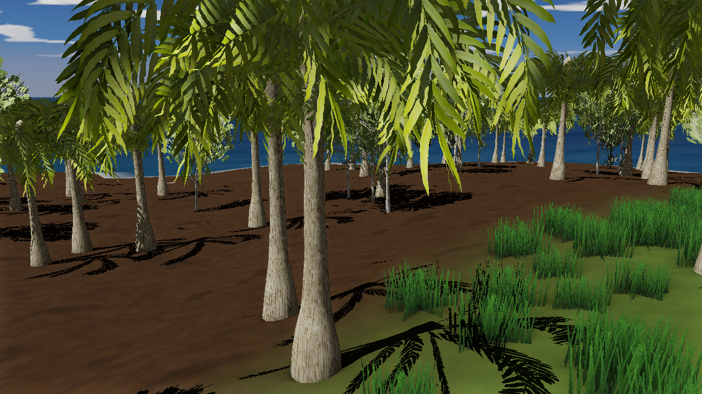

# Fury3D — Vegetation (Kraut trees, LODs, billboards, instancing, wind)

> Status (2026-09-04): shipped with change `add-kraut-vegetation` incl. the
> section-10 follow-ups: corrected LOD tier selection (tier 0 owns
> [t1, 1.0] now), dithered per-instance tier transitions (`FURY_LOD_JITTER=0`
> to A/B), up-biased billboard shading normals, and the grass layer below.
> Validated headless on macOS GL 4.1 (divisor-VBO instancing path). The
> GL 4.3+ SSBO instance-stream path is compiled in but untested on hardware
> yet — it is auto-selected at runtime when SSBOs exist; set
> `FURY_INSTANCE_SSBO=0` to force the divisor path, `=1` to force SSBO
> (validation on Windows GL 4.3+ is a known follow-up).

## Overview

Trees are generated offline by the vendored Kraut-CLI toolchain
(`engine/ThirdParty/Kraut` submodule, `fury kraut` wraps it) and imported
through the regular glTF importer with a kraut-aware postprocess. Rendering
adds: per-tier LOD chains with a billboard terminal tier, two-sided
alpha-cutout foliage shading, leaf-shaped shadows (alpha-tested depth
passes), wind sway from vertex-color weights, and ISM/HISM instanced
rendering for forests.



## The toolchain

```
fury kraut generate <descriptor.tree> [--seed N] [--out dir]
fury kraut import   <tree.glb> [output.json|.bin]
```

- `generate` runs KrautCLI's `--format glb` export (per-LOD meshes
  `<tree>_LOD<n>`, billboard quad `<tree>_Billboard`, `COLOR_0` wind weights,
  PBR materials, `asset.extras.kraut` with LOD thresholds + billboard atlas
  grid + provenance), copies the referenced textures next to the glb
  (`.dds` resolves to `.tga`/`.png` siblings), bakes the billboard atlas with
  KrautPreview (`<stem>_BillboardAtlas.png`, one row of orthographic views),
  and writes per-tier preview screenshots. Deterministic per
  descriptor + seed.
- `import` reads the glb into a scene fragment: the LOD chain keeps the
  extras' thresholds, the billboard becomes the flagged terminal tier,
  foliage materials get MASK + two-sided + wind flags, and the tree is
  scaled meters -> cm at its root (the engine's world unit is cm).

The CMake `kraut_tools` target builds the binaries next to `fury`/`furye`
(POST_BUILD copy). `-DFURY_WITH_KRAUT=OFF` skips the toolchain;
`-DFURY_WITH_KRAUT_PREVIEW=OFF` builds KrautCLI without KrautPreview (no
SDL2 fetch; atlas/previews skipped with a warning at generate time).

Committed samples: `examples/Resource/Trees/{Descriptors,PalmTree2,Tree1}/`
+ `trees.json`, baked by `tools/gen_tree_assets.py` (`--check` verifies the
committed fragments are current). A fresh checkout without the Kraut
submodule still renders the samples. The bake also tone-maps the kraut
content leaf textures (bright lime by default) toward deep palm green via
`FOLIAGE_TONE` -- applied to the foliage textures AND the billboard atlas so
the terminal tier stays color-consistent.

**sRGB caveat**: albedo textures must carry `srgb: true` in the scene's
texture records or the HDR pipeline samples gamma-encoded values as linear
(over-bright, over-saturated). The glTF importer sets this correctly on
baseColor textures, but records baked by early pipeline iterations can be
stale -- check the record, and note that a scene's material blocks embed
their OWN texture records (fixing the entity-level entry alone doesn't fix
the material's; `Material::SetTextureSRGB`/`GetTextureSRGB` bindings exist
for that).

## Rendering pieces

- **LOD chain + billboard flag**: `Mesh::m_LodBillboardFlags` (parallel to
  `m_LodMeshes`, serialized as `lod_billboard_flags`). `IsLodBillboard(i)`
  marks the terminal tier; that tier renders via the BILLBOARD shader
  variant and is skipped in shadow passes (the deepest non-billboard tier
  casts instead). The billboard tier's material travels on the mesh
  (`Mesh::m_BillboardMaterial`, `lod_billboard_material`) because renderer
  material slots key to LOD 0's submesh layout. LOD thresholds come from
  `extras.kraut.lod_thresholds` (Kraut distances converted via the tree's
  bounding radius at reference fov 0.7854) with a synthesized ramp fallback.
  Tier selection (`MeshRender::PickLodForCoverage`): threshold(i) is the
  coverage below which tier i activates (tier 0 owns [t1, 1.0]); the pick is
  dithered per object -- `MeshRender::ComputeLodJitter` applies a stable
  position-hashed coverage jitter (±15%) so neighbors swap tiers at
  different distances instead of popping in lockstep. `FURY_LOD_JITTER=0`
  disables; `FURY_LOD_JITTER=0.4` widens the band for a visible speckle
  demo. Debug view: `LOD_DEBUG_COLORS` switch tints per tier and works
  headless (`docs/BUILD_FLAGS.md`).
- **Billboard shader** (`BILLBOARD` define in `GBuffer.glsl`): the VS builds
  a cylindrical (upright) camera-facing quad from the node/instance position
  and picks the atlas cell by camera azimuth around the trunk axis
  (`u_billboard_atlas` = cols/rows from the material). Cell *k* of the atlas
  shows the tree from azimuth `((k+0.5)/cols - 0.5) * 2pi` around +Z — the
  same formula the KrautPreview `--atlas` baker uses. Shading normals are
  `mix(fwd, up, u_billboard_up_bias)` (default 0.28, tuned for tree canopies;
  per-asset override via `extras.kraut.billboard.up_bias` -- grass writes
  1.0 = pure up to match its card normals). The importer caps the billboard
  tier at 0.12 coverage: a mesh->billboard swap is only invisible once the
  tree is small on screen (the exporter's default ~0.25 visibly popped).
- **Foliage shading**: `Material::m_TwoSided` (cull off per draw) and MASK
  alpha test. Leaf normals are bent to a crown-dome proxy at import
  (KrautImportPostprocess; kraut cards carry card-plane-horizontal normals
  that read dark from overhead). No camera flip -- flipping washed the
  canopy flat at low sun; the dome keeps volume: lit crown, shaded
  underside, thin-leaf translucency when backlit. Deep LOD tiers get the
  same bent normals (the generator's simplified normals are unreliable).
  Shadow depth shaders (`DrawDepth*.glsl`) have ALPHA_TEST variants so leaf
  cards cast leaf-shaped shadows.
- **Wind**: `Material::m_WindEnabled` selects the WIND vertex-shader variant
  (gbuffer + depth, so shadows sway in sync). Displacement is pre-projection
  from `vertex_color` weights (Kraut packs R=branch sway, G=leaf flutter,
  B=phase, A=color variation) with `u_time` (engine clock, `Engine.GetTime`)
  + `u_wind_params` = scene `renderSettings.wind_params`
  (dirX, dirZ, strength, frequency). Meshes without a Colors channel are
  rigid under wind (zero weights).
- **Vertex colors**: `Mesh::Colors` vec4 channel (`vertex_color` attribute),
  populated from glTF `COLOR_0` (vec3/vec4, float or normalized ints).

## Grass (offline baker, no Kraut)

Ground cover is too light for the Kraut pipeline: `tools/gen_grass_assets.py`
bakes `examples/Resource/Trees/Grass/` directly — blade-silhouette alpha
textures (PIL), a hand-rolled `GrassClump.glb` speaking the kraut contract
(`_LOD0` 3 crossed cards, `_LOD1` 2 cards, `_Billboard` 1 quad with a 1x1
atlas, `COLOR_0` wind weights, `extras.kraut` thresholds), imported via the
stock `fury kraut import` into `GrassClump.bin`. Grass vertex normals are
all +Y so clumps light like the terrain; billboard tier reuses the tree
billboard shader path.

Island layer: `tools/gen_island_grass.py` computes splat-aware placement
(dominant grass splat channel + slope/height gates) in **meadow patches**
(habitat seeds -> gaussian blobs; uniform density can't read dense at island
scale) -> `Projects/ocean/grass_points.lua`;
`tests/lua/populate_island_grass.lua` merges the clump fragment into a scene
copy and bakes a `GrassField` InstancedMeshRender (45k instances, no shadow
casting). Wind waves roll across the field via the position-phase term in
the WIND variant (`dot(worldPos.xz, windDir) * 0.00785`, ~800 m wavelength).

Scale notes: instance world matrices + AABBs are cached (rebuilt on edit or
owner move), so the per-frame cost is a frustum test + coverage eval per
instance: ocean_island with 45k grass + 2.3k trees runs ~3.6 ms avg
(278 fps, 123 draw calls). Beyond ~50k VISIBLE instances the remaining
frustum/coverage pass becomes the cost center -- per-cell cluster culling
is the documented next step.
Headless harnesses: `tests/lua/grass_field_perf.lua` (FURY_GRASS_N),
`tests/lua/grass_island_check.lua` (FURY_SCENE/FURY_CAM/FURY_TOD_HOURS).

**ToD in scenes with SkyAtmosphere**: when a sky component has
`sun_from_tod` on (ocean_island does), it overwrites the bound sun node's
rotation every frame -- drive time-of-day via `SkyAtmosphere:SetTimeHours()`
(and `SetAutoAdvance(false)` to pin), not by rotating the light node.

## Instanced static meshes (ISM/HISM)

`InstancedMeshRender` (component, serialized): one shared mesh (with LOD
chain) + per-submesh materials + a list of instance TRS transforms.
Per frame per pass: per-instance frustum culling against cached world AABBs
(the component holds one coarse octree entry covering all instances), then
HISM mode buckets visible instances per LOD tier using `MeshRender`'s
screen-coverage rule per instance (ISM mode draws all at one tier picked
from the aggregate bounds), then one `glDrawElementsInstanced` per
(component, tier, submesh). Shadow passes draw instanced casters at the
deepest non-billboard tier (billboard-terminated chains only -- plain LOD
chains cast from LOD 0, their coarse tiers self-shadow badly), honoring the
per-component `cast_shadows` flag. `cull_distance` (cm, 0 = no cap) drops
instances entirely past a draw distance -- small clutter like grass uses
~80 m instead of paying for far billboards; the cap edge is jittered per
instance (same position hash as the LOD dither) so it reads as a staggered
band, not a hard line.

Instance matrices stream via:
- **SSBO** (GL 4.3+, preferred): shader storage buffer read by
  `gl_InstanceID` (`INSTANCE_SSBO` define). *Untested at writing — see the
  status note above.*
- **Divisor VBO** (GL 3.3/4.1 fallback, e.g. macOS): matrices as four vec4
  attributes (`instance_row0..3`) with `glVertexAttribDivisor(1)`; the
  divisor state is torn down after each draw so shared mesh VAOs never leak
  instance state into non-instanced draws.

The editor inspector exposes mesh/material slots, the ISM/HISM toggle,
instance add/remove/duplicate, and a seeded scatter-over-terrain helper
(std::mt19937, cross-platform deterministic).



## Validation (headless, `fury` + fixed-frame screenshots)

- `tests/lua/instancing_smoke.lua` — 2500 instanced cubes: instance count
  asserted, draw calls flat (< 200; per-instance submission would be >2500).
- `tests/lua/kraut_import_roundtrip.lua` — import a kraut glb, save, reload:
  chain length / thresholds / billboard flag / vertex colors / material
  flags all survive.
- `tests/lua/pipeline_compile_check.lua` — both pipeline JSONs load (every
  new shader variant compiles; SSBO variants skip cleanly on GL < 4.3).
- `tests/lua/tree_preview.lua` — LOD tiers transition with distance
  (prints the active tier per node), billboard tier renders the atlas.
- `tests/lua/vegetation_perf.lua` — ocean_island with ~2300 trees:
  avg frame ms + flat draw-call assert.
- `tests/lua/lod_transition_check.lua` — dithered LOD transitions: a line
  of same-distance instances splits across tier buckets with jitter on vs
  flipping in lockstep with `FURY_LOD_JITTER=0` (batch readout via Lua
  `GetBatchCount`/`GetBatchInfo`); debug-tint speckle:
  `screenshots/lod_jitter_speckle.png`.
- `tests/lua/grass_field_perf.lua` — 3k/12k/48k grass instances:
  ~0.7 us/instance/frame, draw calls flat (6) at every scale.
- `tests/lua/grass_island_check.lua` — island grass layer: ~160 fps avg,
  ~121 draw calls with 80k grass + 2.3k trees; `FURY_TOD_HOURS` for
  time-of-day variants. Shots: `screenshots/island_grass_{vista,close}
  [_tod2].png`.
- `tests/lua/billboard_pop_check.lua` — dolly across the mesh->billboard
  boundary while `--screenshot-series "out.png,N,interval"` captures a
  contact-sheet atlas (the CLI's temporal-capture mode; see docs/CLI.md) —
  per-cell ink/luminance continuity verifies the swap doesn't pop.

| LOD 0 (8 m) | Billboard tier (60 m) | Wind t=0 vs t=2 |
|---|---|---|
|  |  |   |

Billboard atlas (8 cylindrical views of PalmTree2, baked by
`KrautPreview --atlas`):





## Known limits / follow-ups

- The SSBO instance path is preferred but untested on real GL 4.3+
  hardware (macOS dev machines only exercise the divisor fallback);
  validate with a screenshot A/B on Windows before trusting it there.
- Billboard shading normals are up-biased (`u_billboard_up_bias`, tuned
  0.28 default) so billboards track the mesh tiers' sun response instead
  of going dark under overhead sun; a residual ~-50% gap remains at
  perpendicular side sun (a quad has no side leaves). The atlas texture
  itself carries baked top-down lighting from the KrautPreview bake.
- Kraut impostor modes (octahedral-ish multi-view) are richer than the
  cylindrical billboard atlas but a bigger shader lift; not in v1.
- Scatter placement is script/editor-helper driven; an editor paint tool
  is a follow-up.
- Wind is a sway approximation (no branch-hierarchy propagation); the
  weights are Kraut branch-structure derived and tuned in the exporter's
  per-type sway table.
